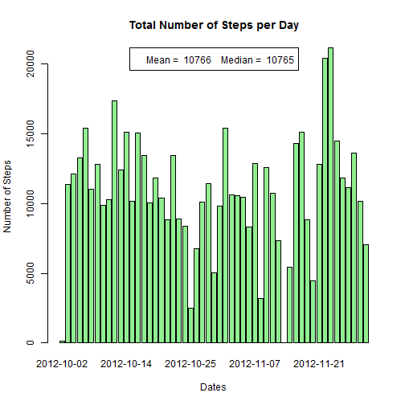
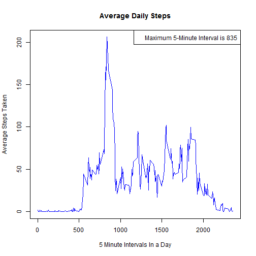
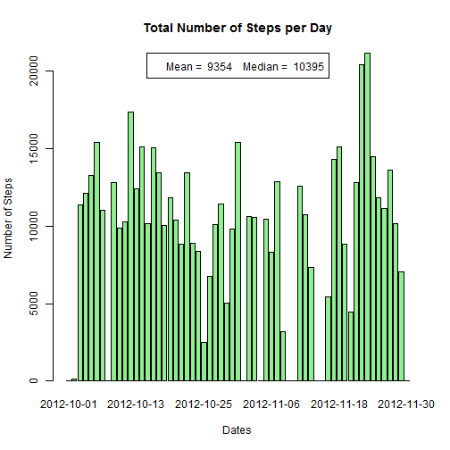
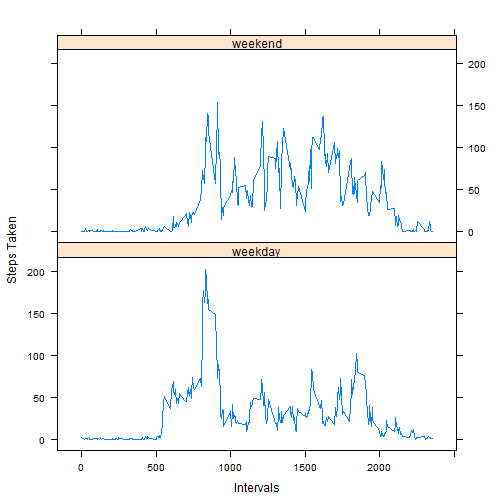

# Reproducible Research: Peer Assessment 1

## Loading and preprocessing the data

```r
## Let's load the necessary libraries
library(graphics)
library(lattice)
## Create the classes vector for the column names
classes <- (c("numeric","character","numeric"))
## Read the activity.csv file and store it to 'act_data'
act_data <-read.csv("activity.csv", sep=",", header = TRUE, colClasses = classes)
## Convert date column
act_data$date <- as.Date(act_data$date)
```

## What is mean total number of steps taken per day?

```r
## Calculate and report the mean and median total number of steps taken per day
t_steps <- aggregate(steps~date, data=act_data, sum)
mn_steps <- mean(t_steps$steps)
md_steps <- median(t_steps$steps)
## Plot the graph
barplot(t_steps$steps, names.arg=t_steps$date, main="Total Number of Steps per Day", xlab="Dates", ylab="Number of Steps", col = "light green")
legend("top", paste("Mean = ",round(mn_steps),"   Median = ",round(md_steps)))
```

 

## What is the average daily activity pattern?

```r
## Aggregate mean steps/interval columns to 'ada'
ada <- aggregate(steps~interval, data=act_data, mean)
## Find maximum average steps and corresponding 5-min interval
max_rec <- which.max(ada$steps)
max_int <- ada[max_rec, 1]
## Plot the graph
plot(ada, type="l", main="Average Daily Steps", xlab="5 Minute Intervals In a Day", ylab="Average Steps Taken", col = "blue")
legend("topright", paste("Maximum 5-Minute Interval is",round(max_int)))
```

 

## Imputing missing values

```r
mydf <- act_data ## Create a new dataset
tna <- sum(is.na(mydf$steps)) ## Total number of NAs
t_vect <- which(is.na(mydf$steps)) ## Assign NAs to vector
## Compute mean steps for each day; aggregate
m_steps <- aggregate(steps~date, data=act_data, mean)
## Use NA vector list to populate mydf with mean steps/day from m_steps dataset
for (n in t_vect) {
    t_date <- grep(mydf$date[n], m_steps$date) ## Look for date match and assign Date vector to integer
    if (length(t_date) == 0) { ## No date match, set steps to 0
      mydf$steps[n] <- 0
    } else {		
        mydf$steps[n] <- m_steps$steps[t_date] ## Assign mean steps for that day
	}
}
## Aggregate total steps/date, mean and median
mydf_steps <- aggregate(steps~date, data=mydf, sum)
mydf_mn <- mean(mydf_steps$steps)
mydf_md <- median(mydf_steps$steps)
## Plot the graph
barplot(mydf_steps$steps, names.arg=mydf_steps$date, main="Total Number of Steps per Day", xlab="Dates", ylab="Number of Steps", col = "light green")
legend("top", paste("Mean = ",round(mydf_mn),"   Median = ",round(mydf_md)))
```

 

## Are there differences in activity patterns between weekdays and weekends?

```r
## Create new factor column named 'day' using ifelse to determine "weekend" or "weekday"
mydf$day <- factor(c(ifelse(weekdays(mydf$date) == "Saturday" | weekdays(mydf$date) == "Sunday", "weekend","weekday")))
## Compute mean steps/interval per day and aggregate
new_mydf <- aggregate(steps~interval+day, data=mydf, mean)
## Plot the graph
xyplot(steps ~ interval | day, data = new_mydf, type = "l",xlab="Intervals", ylab="Steps Taken",layout = c(1, 2))
```

 
